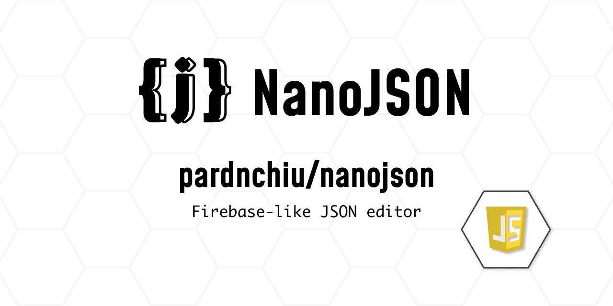
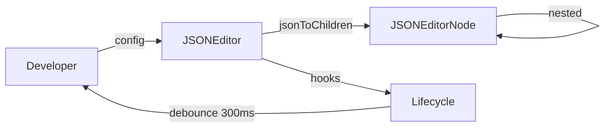

> [!NOTE]
> This README was generated by [SKILL](https://github.com/pardnchiu/skill-readme-generate), get the ZH version from [here](./README.zh.md).



# NanoJSON

[](https://www.npmjs.com/package/@pardnchiu/nanojson)
[](https://www.npmjs.com/package/@pardnchiu/nanojson)
[](LICENSE)

> A lightweight JSON visual editor built with pure JavaScript and native DOM APIs, embeddable in any webpage without third-party dependencies.

## Table of Contents

- [Features](#features)
- [Architecture](#architecture)
- [File Structure](#file-structure)
- [License](#license)
- [Author](#author)
- [Stars](#stars)

## Features

> `npm i @pardnchiu/nanojson` · [Documentation](./doc.md)

### Zero-Dependency Embeddable Design

NanoJSON is built entirely on native browser APIs with no runtime dependencies. It mounts into any existing DOM element via the `id` config option and injects its CSS dynamically, so integration requires nothing more than a single script tag or one npm install command.

### Dynamic Type Switching with Structured Visual Editing

Every node supports live type switching between string, number, boolean, array, and object without losing existing data. The tree interface renders hierarchical JSON in a collapsible nested layout, with configurable initial collapse state (`collapsed`) and optional remove confirmation dialogs (`confirmKeyRemove`).

### Full Lifecycle Control and Flexible Data Import

Six lifecycle hooks — beforeRender, rendered, beforeUpdate, updated, beforeDestroy, destroyed — each supporting a `false` return value to cancel the operation. Updates are debounced at 300ms to prevent excessive triggering. The `import()` method accepts plain objects, File objects, and URL strings, while `export()` downloads the formatted JSON in one click.

## Architecture



## File Structure

```
NanoJSON/
├── dist/
│   ├── NanoJSON.js           # UMD minified build
│   ├── NanoJSON.esm.js       # ES Module build
│   ├── NanoJSON.debug.js     # Unminified debug build
│   └── NanoJSON.css          # Stylesheet
├── src/
│   ├── model/
│   │   ├── JSONEditor.js     # Main editor class
│   │   ├── JSONEditorNode.js # Node model class
│   │   └── Lifecycle.js      # Lifecycle manager
│   └── function/             # DOM utilities and component functions
├── page/
│   └── live.html             # Live demo page
└── package.json
```

## License

This project is licensed under the [MIT LICENSE](LICENSE).

## Author


<h4 style="padding-top: 0">邱敬幃 Pardn Chiu</h4>

<a href="mailto:dev@pardn.io" target="_blank">

</a> <a href="https://linkedin.com/in/pardnchiu" target="_blank">

</a>

## Stars

[](https://www.star-history.com/#pardnchiu/NanoJSON&Date)

***

©️ 2025 [邱敬幃 Pardn Chiu](https://linkedin.com/in/pardnchiu)
