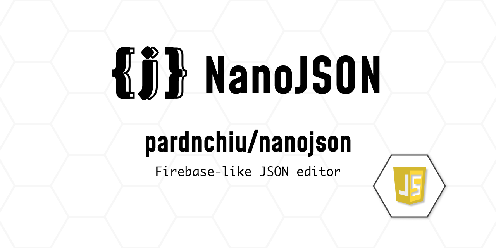

# NanoJSON

[](https://github.com/pardnchiu)
[](LICENSE)
[](https://www.npmjs.com/package/@pardnchiu/nanojson)
[](https://www.jsdelivr.com/package/npm/@pardnchiu/nanojson)

> A Firebase-style JSON editor built with VanillaJS and native APIs, featuring visual editing, dynamic type switching, and file import/export capabilities. Suitable for website embedding and JSON data editing.<br>
>
> This project has been licensed under MIT since 2025/07/06, with complete removal of `.git-crypt` encryption.

## Core Features

### Zero Third-Party Dependencies
Built entirely on native DOM APIs without any third-party dependencies, easily embeddable in any web project.

### Visual JSON Editing Experience
Displays JSON data in a tree structure similar to Firebase, supporting collapse/expand, dynamic node addition/deletion, providing an intuitive and familiar editing interface.

### Complete Type Support
Supports 5 standard JSON data types (`string`, `number`, `boolean`, `array`, `object`), allowing real-time type switching while maintaining data integrity.

## Usage

### Installation

#### Install via npm
```bash
npm install @pardnchiu/nanojson
```

#### Include via CDN

##### UMD Version
```html
<script src="https://cdn.jsdelivr.net/npm/@pardnchiu/nanojson@[VERSION]/dist/NanoJSON.js"></script>
```

##### ES Module Version
```javascript
import { JSONEditor } from "https://cdn.jsdelivr.net/npm/@pardnchiu/nanojson@[VERSION]/dist/NanoJSON.esm.js";
```

### Initialization
```javascript
// Basic initialization
const editor = new JSONEditor({
  id: "json-editor-container",     // Element ID
  title: "JSON Editor",            // Editor title
  description: "Edit your JSON",   // Editor description
  fill: true,                      // Fill parent container
  json: {                          // Initial JSON data
    name: "NanoJSON",
    version: "0.3.4",
    features: ["Lightweight", "Pure JS", "Visual Editing"]
  }
});

// Advanced configuration
const advancedEditor = new JSONEditor({
  id: "advanced-editor",
  title: "Advanced JSON Editor",
  description: "Full-featured JSON Editor",
  fill: 1,                         // Fill container (1 = true, 0 = false)
  button: {                        // Feature button configuration
    import: true,                  // File import
    export: true,                  // File export
    reset: true                    // Reset editor
  },
  when: {                          // Lifecycle callbacks
    rendered: () => {
      console.log("Editor rendered");
    },
    updated: () => {
      console.log("Editor content updated");
    }
  }
});

// Initialize from file
const fileEditor = new JSONEditor({
  id: "file-editor",
  path: "/data/sample.json",       // Load from URL
  // file: fileInput.files[0],     // Load from file object
});
```

## Configuration Options
```javascript
const config = {
  id: "container-id",       // Target container element ID
  title: "",                // Editor title (default: "")
  description: "",          // Editor description (default: "")
  fill: 1,                  // Fill parent container (default: 1)
  readonly: 0,              // Read-only mode (default: 0)
  json: {},                 // Initial JSON data object
  file: null,               // File object (for file upload)
  path: "",                 // JSON file URL path
  button: {                 // Feature button toggles
    import: true,           // File import button (default: true)
    export: true,           // File export button (default: true)
    reset: true             // Reset button (default: true)
  },
  when: {                   // Lifecycle events
    beforeRender: null,     // Before render
    rendered: null,         // After render
    beforeUpdate: null,     // Before update
    updated: null,          // After update
    beforeDestroy: null,    // Before destroy
    destroyed: null         // After destroy
  }
};
```

## Editor Features

### Data Types

#### String
```javascript
// Text input field editing
"Hello World"
```

#### Number
```javascript
// Number input field, automatically filters non-numeric characters
42
3.14159
-123
```

#### Boolean
```javascript
// Dropdown selection
true
false
```

#### Array
```javascript
// Supports nested structure, add/remove elements
[
  "item1",
  "item2", 
 123,
 true,
 {
   "nested": "object"
 }
]
```

#### Object
```javascript
// Supports nested structure, add/remove properties
{
  "key1": "value1",
  "key2": 456,
  "nested": {
    "deep": "value"
  }
}
```

## Available Methods

- **Get JSON Data**
  ```javascript
  const jsonString = editor.json;  // Get formatted JSON string
  console.log(jsonString);
  ```

- **Import Data**
  ```javascript
  // Import from object
  await editor.import({
    name: "New Data",
    version: "1.0.0"
  });
  
  // Import from file
  const fileInput = document.querySelector('input[type="file"]');
  await editor.import(fileInput.files[0]);
  
  // Import from URL
  await editor.import('/path/to/data.json');
  ```

- **Export File**
  ```javascript
  editor.export();  // Automatically download JSON file
  ```

- **Reset Editor**
  ```javascript
  editor.reset();   // Clear all content
  ```

- **Add Root Node**
  ```javascript
  editor.insert();  // Add empty root node
  ```

- **Re-render**
  ```javascript
  editor.render();  // Force re-render editor
  ```

- **Edit Mode**
  ```javascript
  editor.enable();
  ```

- **Read-only Mode**
  ```javascript
  editor.disable();
  ```


## Lifecycle
```javascript
const editor = new JSONEditor({
  id: "editor",
  when: {
    beforeRender: () => {
      console.log("About to render");
      // Return false to prevent rendering
    },
    rendered: () => {
      console.log("Render complete");
      // Post-initialization processing
    },
    beforeUpdate: () => {
      console.log("About to update content");
      // Return false to prevent update
    },
    updated: () => {
      console.log("Content updated");
      // Post-update processing, e.g., sync to server
    },
    beforeDestroy: () => {
      console.log("About to destroy editor");
    },
    destroyed: () => {
      console.log("Editor destroyed");
    }
  }
});
```

### File Handling Mechanism

#### Supported Formats
- Only supports `.json` file format
- Automatically validates JSON syntax correctness

#### Export Function
- Automatically formats JSON (4-space indentation)
- File naming format: `JSONEditor-{timestamp}.json`

## License

This project is licensed under the [MIT](LICENSE) License.

## Creator


<h4 style="padding-top: 0">邱敬幃 Pardn Chiu</h4>

<a href="mailto:dev@pardn.io" target="_blank">
    
</a> <a href="https://linkedin.com/in/pardnchiu" target="_blank">
    
</a>

## Star History

[](https://www.star-history.com/#pardnchiu/NanoJSON&Date)

***

©️ 2025 [邱敬幃 Pardn Chiu](https://pardn.io)
