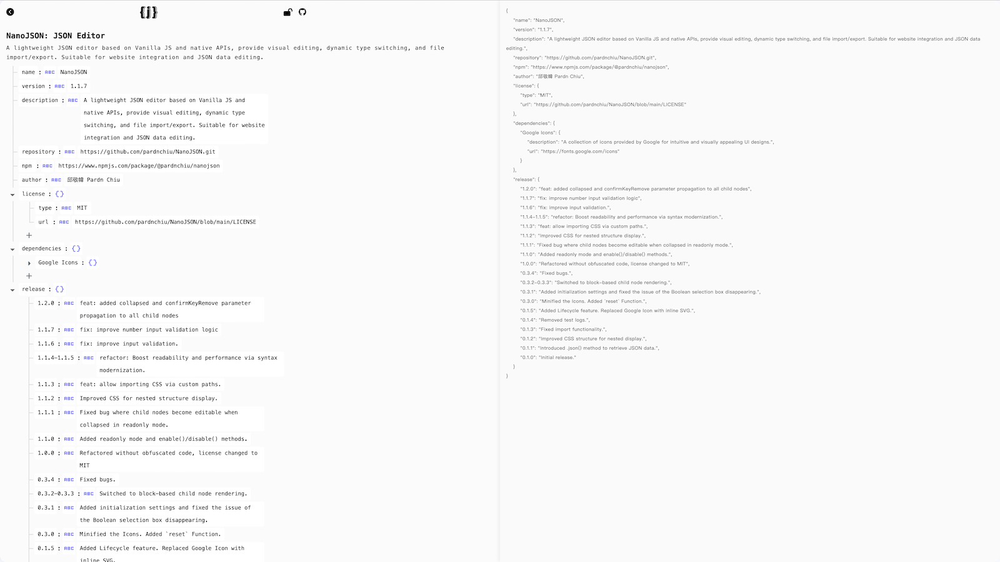
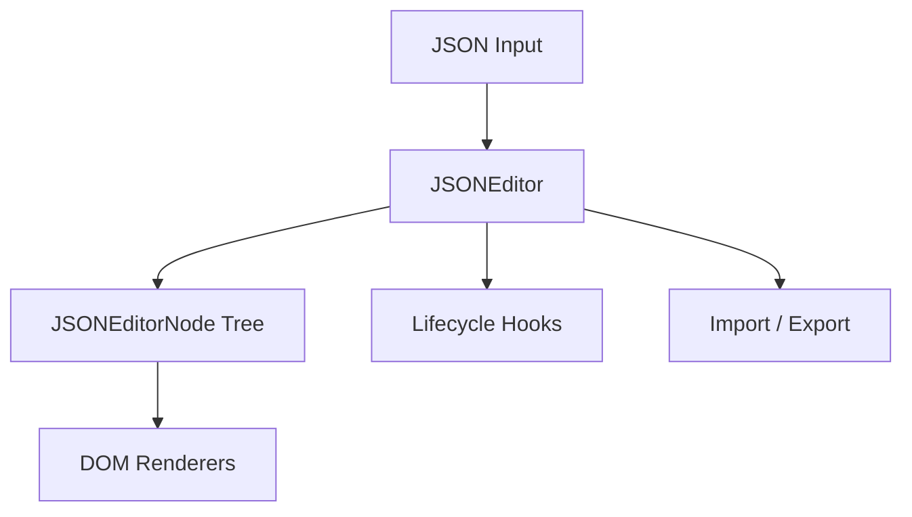

> [!NOTE]
> This README was generated by [SKILL](https://github.com/agenvoy/skill-readme-generate), get the ZH version from [here](./doc/README.zh.md).

***

<picture>

</picture>

<strong>A LIGHTWEIGHT VISUAL JSON EDITOR BUILT WITH PURE JAVASCRIPT</strong>

***

> A pure JavaScript library with zero-dependency visual tree editing, per-node dynamic type switching, and full lifecycle hooks

## Table of Contents

- [Features](#features)
- [Preview](#preview)
- [Architecture](#architecture)
- [License](#license)
- [Author](#author)

## Features

> `npm install @pardnchiu/nanojson` · [Documentation](./doc/doc.md)

- **Zero-dependency visual editing** — A tree-based JSON editor built with pure JavaScript and native DOM APIs, no frontend framework required.
- **Per-node dynamic type switching** — Every node can switch live between string / number / boolean / object / array / null and re-render instantly.
- **Full lifecycle hooks** — Six hooks (beforeRender / rendered / beforeUpdate / updated / beforeDestroy / destroyed) with a 300ms debounce on updates.
- **Flexible data import/export** — Accepts a JavaScript object, a File object, or a URL string as the data source, plus one-click download of the current JSON.

## Preview

## Architecture

> [Full Architecture](./doc/architecture.md)

```mermaid
graph TB
    A[JSON Input] --> B[JSONEditor]
    B --> C[JSONEditorNode Tree]
    C --> D[DOM Renderers]
    B --> E[Lifecycle Hooks]
    B --> F[Import / Export]
```

## License

This project is licensed under the [MIT LICENSE](LICENSE).

## Author

<h4 style="padding-top: 0">邱敬幃 Pardn Chiu</h4>

<a href="mailto:hi@pardn.io">hi@pardn.io</a> 
<a href="https://www.linkedin.com/in/pardnchiu">https://www.linkedin.com/in/pardnchiu</a>

***

©️ 2025 [邱敬幃 Pardn Chiu](https://www.linkedin.com/in/pardnchiu)
