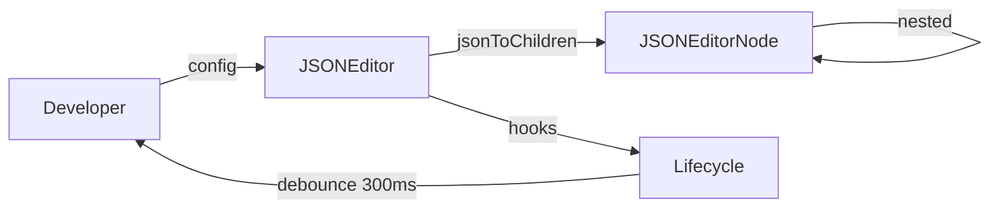

> [!NOTE]
> 此 README 由 [SKILL](https://github.com/pardnchiu/skill-readme-generate) 生成，英文版請參閱 [這裡](./README.md)。


# NanoJSON

[](https://www.npmjs.com/package/@pardnchiu/nanojson)
[](https://www.npmjs.com/package/@pardnchiu/nanojson)
[](LICENSE)

> 以純 JavaScript 和原生 DOM API 打造的輕量 JSON 視覺編輯器，無需任何第三方依賴即可嵌入任何網頁。

## 目錄

- [功能特點](#功能特點)
- [架構](#架構)
- [檔案結構](#檔案結構)
- [授權](#授權)
- [Author](#author)
- [Stars](#stars)

## 功能特點

> `npm i @pardnchiu/nanojson` · [完整文件](./doc.zh.md)

### 零依賴嵌入式設計

NanoJSON 完全基於原生瀏覽器 API 構建，無任何執行期依賴。透過 `id` 設定即可掛載至頁面上任意已存在的 DOM 元素，CSS 樣式也以動態載入方式注入，整合流程僅需一個 script 標籤或一行 npm 安裝指令。

### 動態型別切換與結構化視覺編輯

每個節點均支援在 string、number、boolean、array、object 五種型別之間即時切換，切換過程中保留既有資料結構。樹狀介面以可折疊的巢狀方式呈現層級 JSON，初始展開狀態（`collapsed`）與移除確認行為（`confirmKeyRemove`）皆可透過設定靈活控制。

### 完整生命週期控制與彈性資料匯入

提供 beforeRender、rendered、beforeUpdate、updated、beforeDestroy、destroyed 六個生命週期鉤子，各事件均支援回傳 `false` 取消操作，更新事件並附有 300ms Debounce 機制以避免頻繁觸發。`import()` 方法接受物件、File 物件、URL 字串三種格式，`export()` 則一鍵下載格式化 JSON 檔案。

## 架構



## 檔案結構

```
NanoJSON/
├── dist/
│   ├── NanoJSON.js           # UMD 壓縮版本
│   ├── NanoJSON.esm.js       # ES Module 版本
│   ├── NanoJSON.debug.js     # 除錯用未壓縮版本
│   └── NanoJSON.css          # 樣式表
├── src/
│   ├── model/
│   │   ├── JSONEditor.js     # 主要編輯器類別
│   │   ├── JSONEditorNode.js # 節點模型類別
│   │   └── Lifecycle.js      # 生命週期管理
│   └── function/             # DOM 工具與元件函式
├── page/
│   └── live.html             # 線上展示頁面
└── package.json
```

## 授權

本專案採用 [MIT LICENSE](LICENSE)。

## Author


<h4 style="padding-top: 0">邱敬幃 Pardn Chiu</h4>

<a href="mailto:dev@pardn.io" target="_blank">

</a> <a href="https://linkedin.com/in/pardnchiu" target="_blank">

</a>

## Stars

[](https://www.star-history.com/#pardnchiu/NanoJSON&Date)

***

©️ 2025 [邱敬幃 Pardn Chiu](https://linkedin.com/in/pardnchiu)
