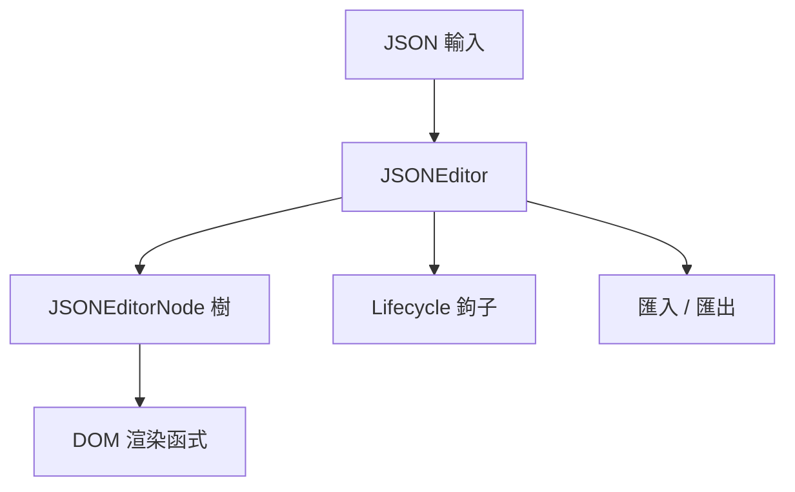

> [!NOTE]
> 此 README 由 [SKILL](https://github.com/agenvoy/skill-readme-generate) 生成，英文版請參閱 [這裡](../README.md)。

***

<picture>

</picture>

<strong>A LIGHTWEIGHT VISUAL JSON EDITOR BUILT WITH PURE JAVASCRIPT</strong>

***

> Pure JavaScript 函式庫，具備零依賴視覺化樹狀編輯、逐節點動態型別切換與完整生命週期鉤子

## 目錄

- [功能特點](#功能特點)
- [預覽](#預覽)
- [架構](#架構)
- [授權](#授權)
- [Author](#author)

## 功能特點

> `npm install @pardnchiu/nanojson` · [完整文件](./doc.zh.md)

- **零依賴視覺化編輯** — 純 JavaScript 與原生 DOM API 實作樹狀 JSON 編輯器，無需任何前端框架。
- **逐節點動態型別切換** — 每個節點可在 string / number / boolean / object / array / null 間即時切換並重繪。
- **完整生命週期鉤子** — 提供 beforeRender / rendered / beforeUpdate / updated / beforeDestroy / destroyed 六個掛鉤，更新並帶 300ms 防抖。
- **彈性資料匯入匯出** — 支援 JavaScript 物件、File 物件、URL 字串三種資料來源，並可一鍵下載目前 JSON。

## 預覽

## 架構

> [完整架構](./architecture.zh.md)

## 授權

本專案採用 [MIT LICENSE](../LICENSE)。

## Author

<h4 style="padding-top: 0">邱敬幃 Pardn Chiu</h4>

<a href="mailto:hi@pardn.io">hi@pardn.io</a> 
<a href="https://www.linkedin.com/in/pardnchiu">https://www.linkedin.com/in/pardnchiu</a>

***

©️ 2025 [邱敬幃 Pardn Chiu](https://www.linkedin.com/in/pardnchiu)
