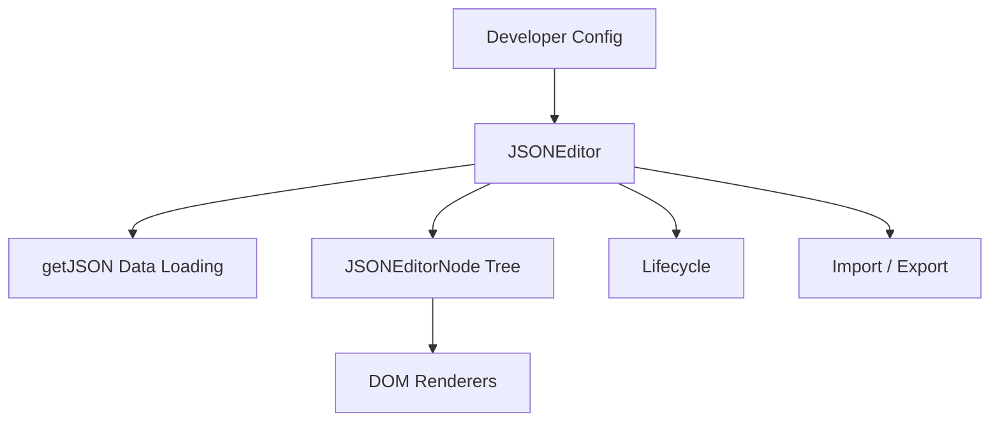
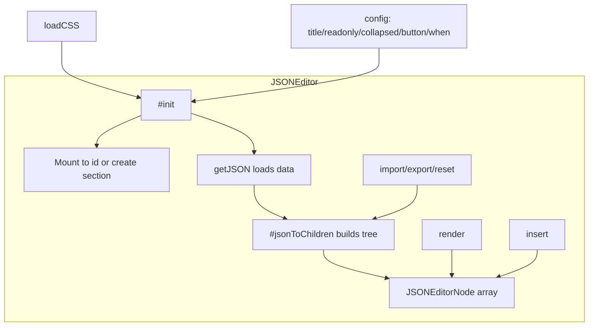
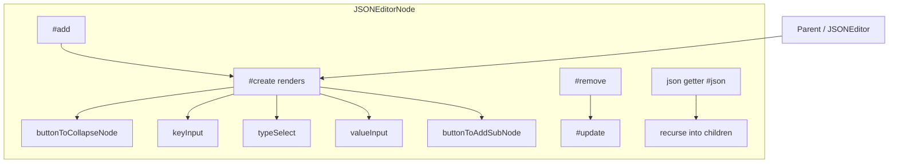
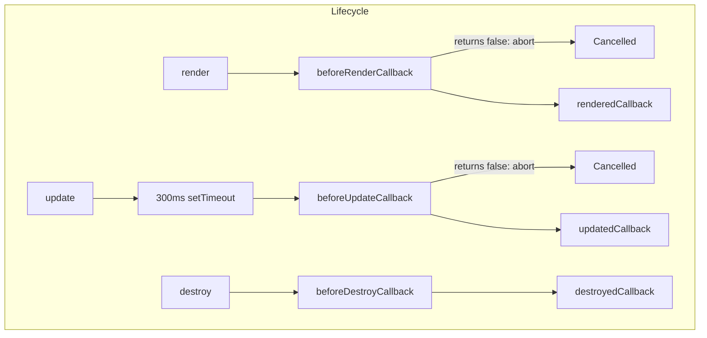
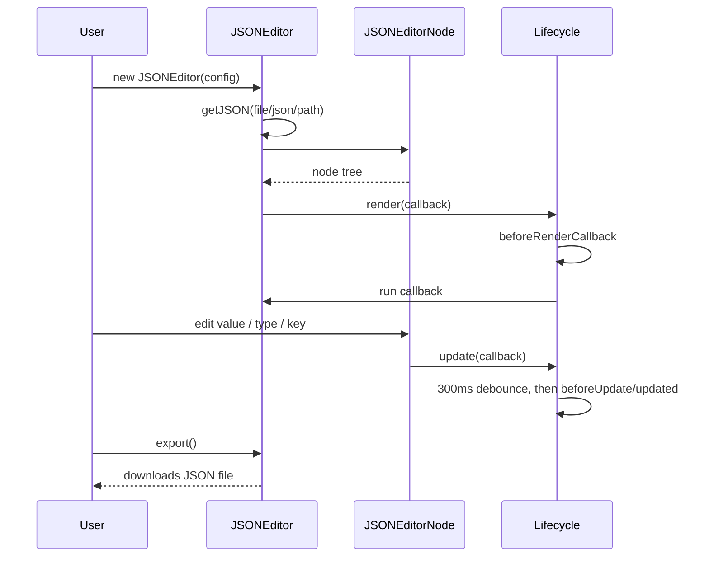

# NanoJSON - Architecture

> Back to [README](../README.md)

## Overview

## Module: JSONEditor

The root controller. Mounts to the DOM, loads the initial data, manages the child node tree, and coordinates import/export with the lifecycle.

## Module: JSONEditorNode

A recursive tree node. Manages its own key, type, children, and collapsed state, and handles its own local DOM re-render.

## Module: Lifecycle

Centralizes the six lifecycle hooks and applies a 300ms debounce to update events to avoid excessive triggering.

## Data Flow

***

©️ 2025 [邱敬幃 Pardn Chiu](https://www.linkedin.com/in/pardnchiu)
