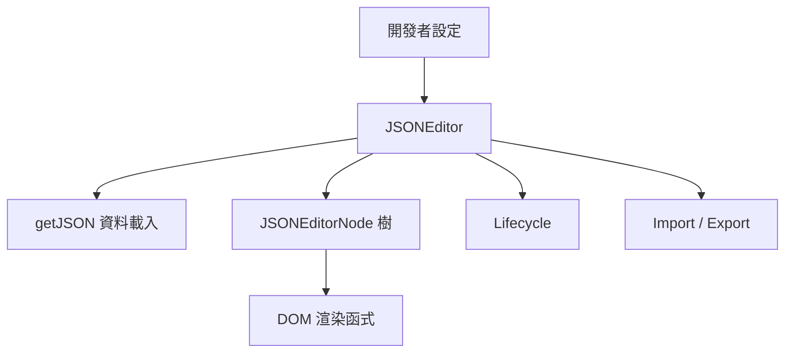
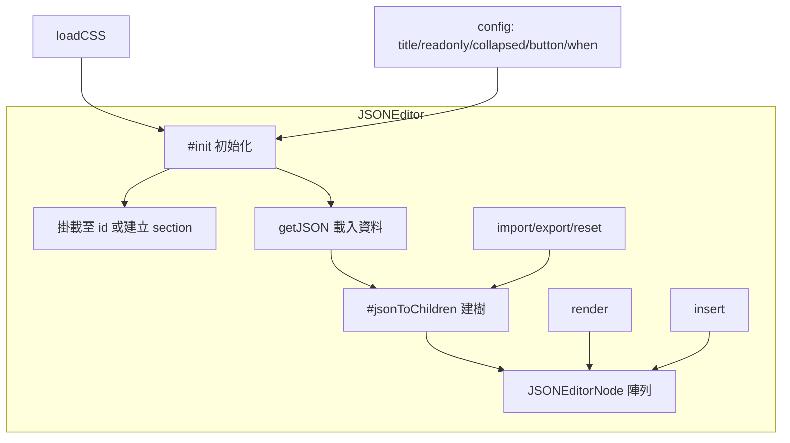
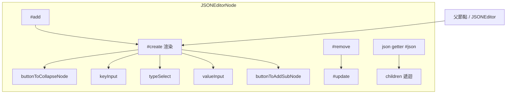
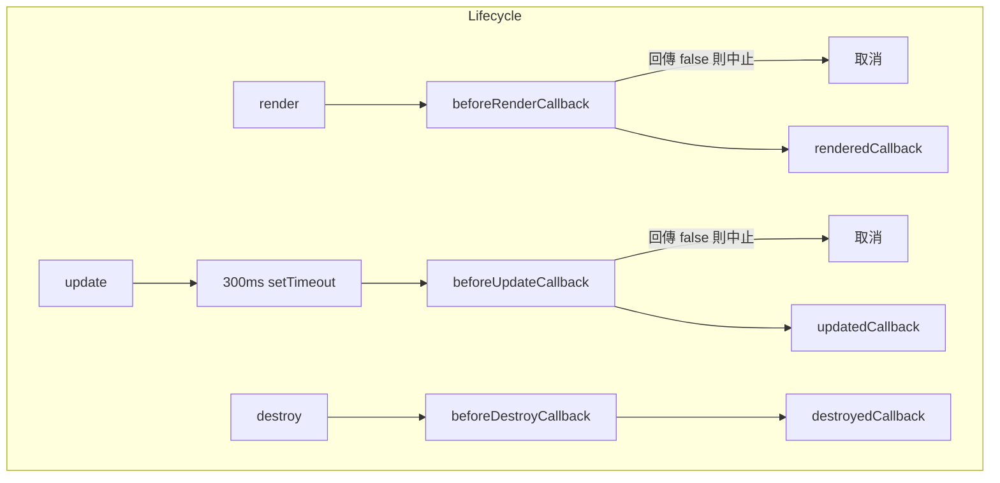
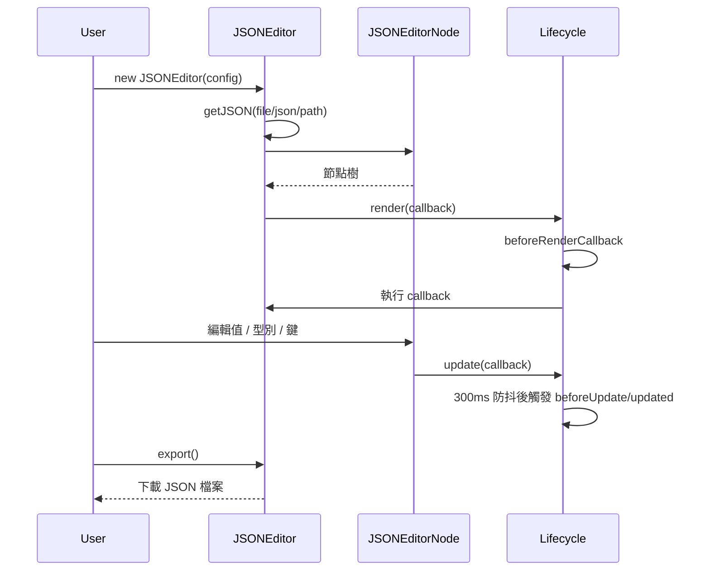

# NanoJSON - 架構

> 返回 [README](./README.zh.md)

## 概覽

## Module: JSONEditor

根控制器，負責掛載 DOM、載入初始資料、管理子節點樹，並協調匯入 / 匯出與生命週期。

## Module: JSONEditorNode

樹狀結構中的遞迴節點，管理自身的鍵值、型別、子節點與折疊狀態，並負責局部 DOM 重繪。

## Module: Lifecycle

集中管理六個生命週期鉤子，並對更新事件套用 300ms 防抖，避免頻繁觸發。

## 資料流

***

©️ 2025 [邱敬幃 Pardn Chiu](https://www.linkedin.com/in/pardnchiu)
